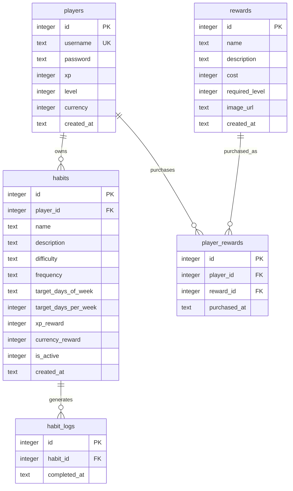

# Database Entity Relationship Model

```mermaid
erDiagram
    players ||--o{ habits : owns
    habits ||--o{ habit_logs : generates
    players ||--o{ player_rewards : purchases
    rewards ||--o{ player_rewards : purchased_as

    players {
        integer id PK
        text username UK
        text password
        integer xp
        integer level
        integer currency
        text created_at
    }

    habits {
        integer id PK
        integer player_id FK
        text name
        text description
        text difficulty
        text frequency
        text target_days_of_week
        integer target_days_per_week
        integer xp_reward
        integer currency_reward
        integer is_active
        text created_at
    }

    habit_logs {
        integer id PK
        integer habit_id FK
        text completed_at
    }

    rewards {
        integer id PK
        text name
        text description
        integer cost
        integer required_level
        text image_url
        text created_at
    }

    player_rewards {
        integer id PK
        integer player_id FK
        integer reward_id FK
        text purchased_at
    }
```
