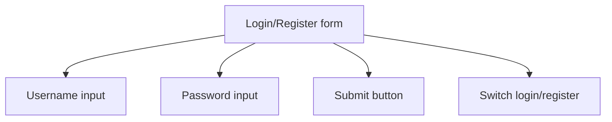
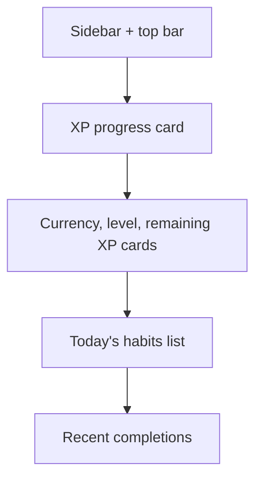
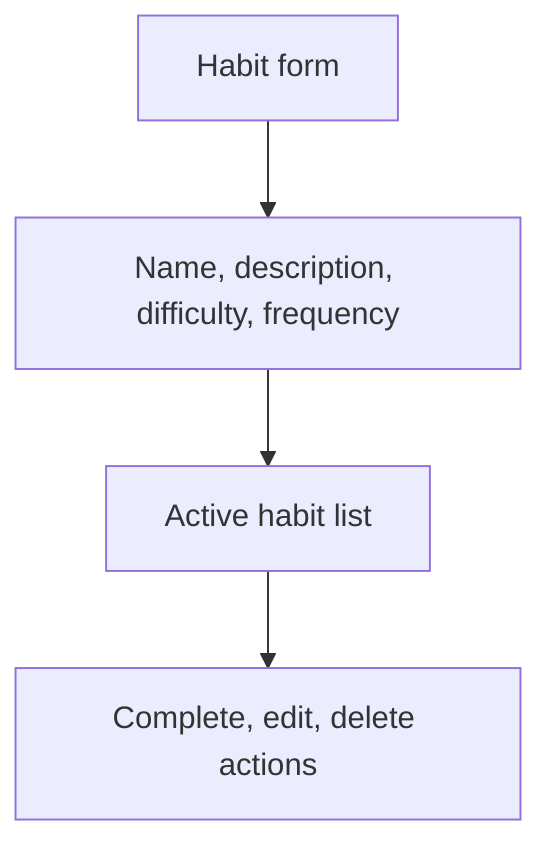
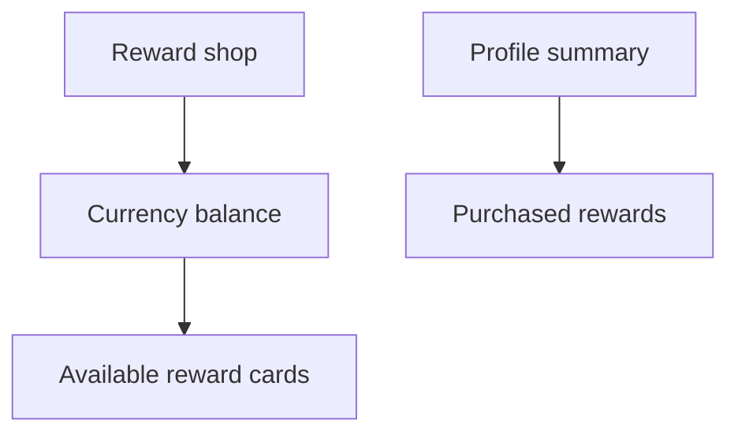

# GUI Wireframes

## Authentication

```mermaid
flowchart TB
    form["Login/Register form"]
    username["Username input"]
    password["Password input"]
    submit["Submit button"]
    switchMode["Switch login/register"]

    form --> username
    form --> password
    form --> submit
    form --> switchMode
```

## Dashboard

```mermaid
flowchart TB
    nav["Sidebar + top bar"]
    progress["XP progress card"]
    stats["Currency, level, remaining XP cards"]
    habits["Today's habits list"]
    history["Recent completions"]

    nav --> progress
    progress --> stats
    stats --> habits
    habits --> history
```

## Habit Management

```mermaid
flowchart TB
    form["Habit form"]
    fields["Name, description, difficulty, frequency"]
    list["Active habit list"]
    actions["Complete, edit, delete actions"]

    form --> fields
    fields --> list
    list --> actions
```

## Reward Shop And Profile

```mermaid
flowchart TB
    shop["Reward shop"]
    balance["Currency balance"]
    cards["Available reward cards"]
    profile["Profile summary"]
    purchased["Purchased rewards"]

    shop --> balance
    balance --> cards
    profile --> purchased
```
