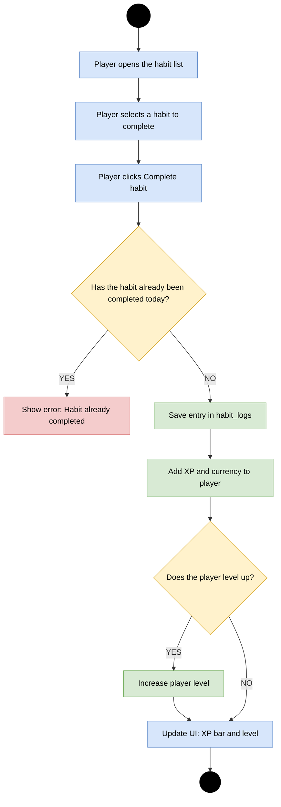

# Activity Diagram - Completing a Habit

## Purpose

This diagram shows the process of marking a habit as completed. It includes selecting a habit, checking whether it has already been completed today, saving a log entry, granting XP and currency, and updating the player's level when needed.

