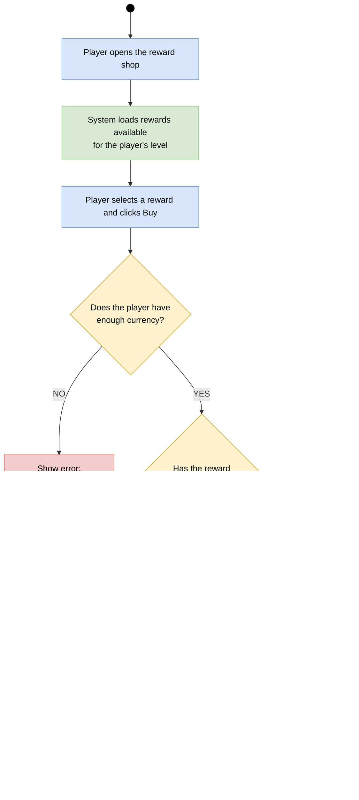

# Activity Diagram - Buying a Reward

## Purpose

This diagram describes how a player buys a reward. The system loads rewards available for the player's level, checks the currency balance and purchase history, saves the purchase, and updates the interface.

