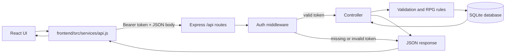

# API Flow Diagram

## Purpose

This diagram shows how authenticated frontend requests move through the backend API, middleware, controllers, database, and JSON response layer.

```mermaid
flowchart LR
    ui["React UI"]
    apiService["frontend/src/services/api.js"]
    express["Express /api routes"]
    auth["Auth middleware"]
    controller["Controller"]
    rules["Validation and RPG rules"]
    db[("SQLite database")]
    response["JSON response"]

    ui --> apiService
    apiService -->|Bearer token + JSON body| express
    express --> auth
    auth -->|valid token| controller
    auth -->|missing or invalid token| response
    controller --> rules
    rules --> db
    db --> controller
    controller --> response
    response --> apiService
    apiService --> ui
```
