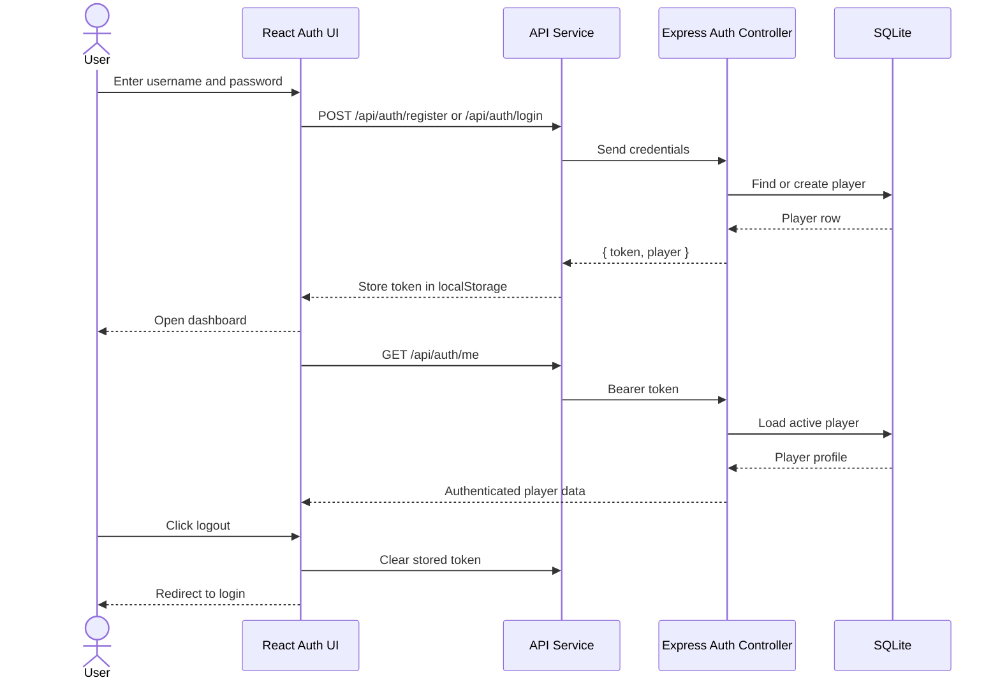

# Authentication Sequence

## Purpose

This sequence diagram documents registration, login, token storage, authenticated profile loading, and logout.

```mermaid
sequenceDiagram
    actor User
    participant UI as React Auth UI
    participant API as API Service
    participant Auth as Express Auth Controller
    participant DB as SQLite

    User->>UI: Enter username and password
    UI->>API: POST /api/auth/register or /api/auth/login
    API->>Auth: Send credentials
    Auth->>DB: Find or create player
    DB-->>Auth: Player row
    Auth-->>API: { token, player }
    API-->>UI: Store token in localStorage
    UI-->>User: Open dashboard

    UI->>API: GET /api/auth/me
    API->>Auth: Bearer token
    Auth->>DB: Load active player
    DB-->>Auth: Player profile
    Auth-->>UI: Authenticated player data

    User->>UI: Click logout
    UI->>API: Clear stored token
    UI-->>User: Redirect to login
```
