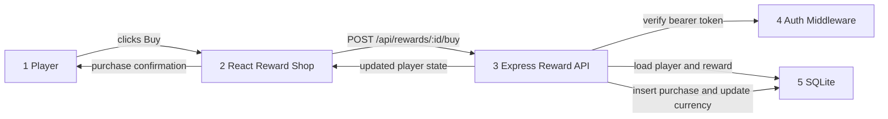

# Communication Diagram - Reward Purchase

## Purpose

This diagram shows object-level communication between the player, frontend, backend, auth middleware, and database during reward purchase.

```mermaid
flowchart LR
    player["1 Player"]
    frontend["2 React Reward Shop"]
    backend["3 Express Reward API"]
    auth["4 Auth Middleware"]
    db["5 SQLite"]

    player -- "clicks Buy" --> frontend
    frontend -- "POST /api/rewards/:id/buy" --> backend
    backend -- "verify bearer token" --> auth
    backend -- "load player and reward" --> db
    backend -- "insert purchase and update currency" --> db
    backend -- "updated player state" --> frontend
    frontend -- "purchase confirmation" --> player
```
