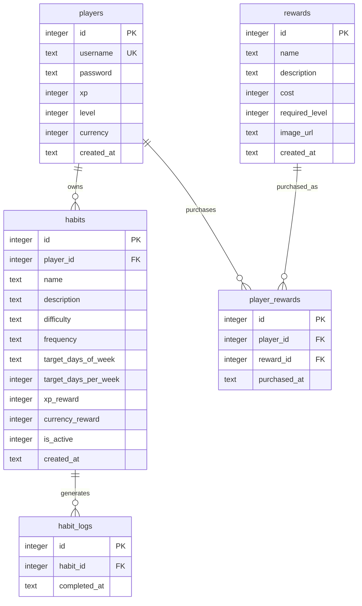

# Database Entity Relationship Model

## Purpose

This ERD describes the SQLite data model used by the backend. It includes authentication, habits, completion logs, rewards, and reward purchase history.

## Notes

* `players.username` is unique and is used for login.
* `players.password` stores a hashed password, not the raw password.
* `habits.player_id` links every habit to its owner.
* `habits.is_active` supports soft-delete, so deleted habits can be hidden without removing historical logs.
* `habit_logs` stores completion history and is checked to prevent duplicate same-day completion.
* `player_rewards` has a unique `(player_id, reward_id)` constraint so the same reward cannot be purchased twice.
* Indexes support habit lookup by player, habit-log lookup by habit/date, and purchased-reward lookup by player.
