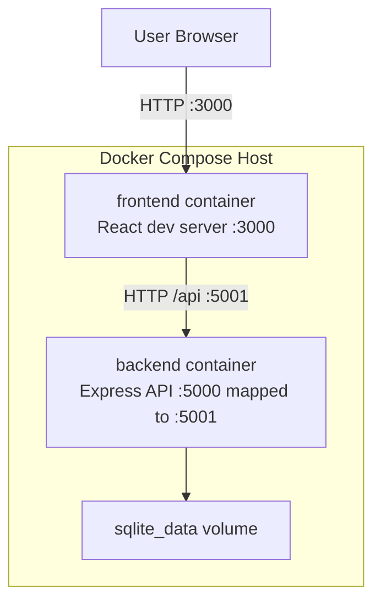

# Deployment Diagram - Docker Runtime

## Purpose

This diagram shows the local Docker Compose runtime with frontend, backend, and persistent SQLite storage.

```mermaid
flowchart TB
    user["User Browser"]

    subgraph docker[Docker Compose Host]
        frontend["frontend container\nReact dev server :3000"]
        backend["backend container\nExpress API :5000 mapped to :5001"]
        volume["sqlite_data volume"]
    end

    user -->|HTTP :3000| frontend
    frontend -->|HTTP /api :5001| backend
    backend --> volume
```
