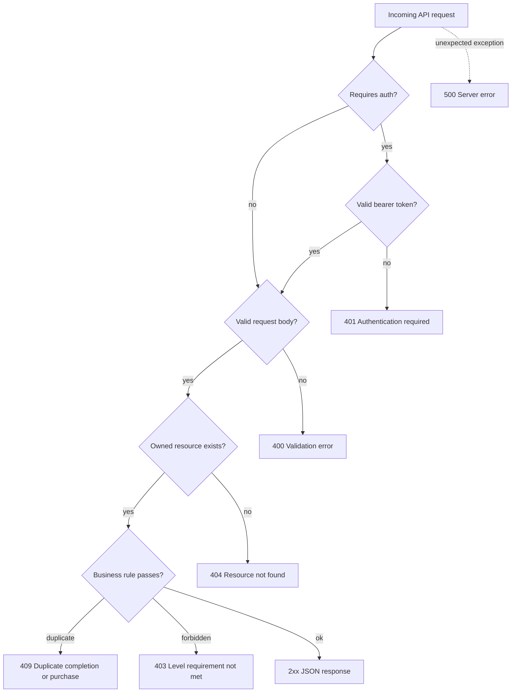

# Error Handling Flow

## Purpose

This flowchart documents the main API error paths and how they return consistent JSON error responses.

```mermaid
flowchart TB
    request["Incoming API request"]
    auth{"Requires auth?"}
    token{"Valid bearer token?"}
    validation{"Valid request body?"}
    ownership{"Owned resource exists?"}
    business{"Business rule passes?"}
    success["2xx JSON response"]
    authError["401 Authentication required"]
    validationError["400 Validation error"]
    notFound["404 Resource not found"]
    conflict["409 Duplicate completion or purchase"]
    forbidden["403 Level requirement not met"]
    serverError["500 Server error"]

    request --> auth
    auth -- yes --> token
    auth -- no --> validation
    token -- no --> authError
    token -- yes --> validation
    validation -- no --> validationError
    validation -- yes --> ownership
    ownership -- no --> notFound
    ownership -- yes --> business
    business -- duplicate --> conflict
    business -- forbidden --> forbidden
    business -- ok --> success
    request -. unexpected exception .-> serverError
```
