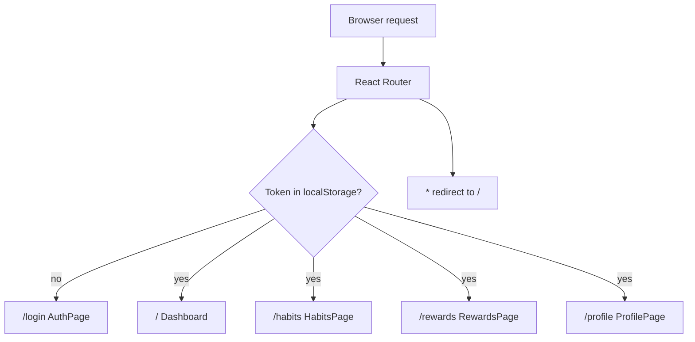

# Frontend Routing Diagram

## Purpose

This diagram explains how React routes are protected and which screens are available after authentication.

```mermaid
flowchart TB
    start["Browser request"]
    app["React Router"]
    protected{"Token in localStorage?"}
    login["/login AuthPage"]
    dashboard["/ Dashboard"]
    habits["/habits HabitsPage"]
    rewards["/rewards RewardsPage"]
    profile["/profile ProfilePage"]
    fallback["* redirect to /"]

    start --> app
    app --> protected
    protected -- no --> login
    protected -- yes --> dashboard
    protected -- yes --> habits
    protected -- yes --> rewards
    protected -- yes --> profile
    app --> fallback
```
