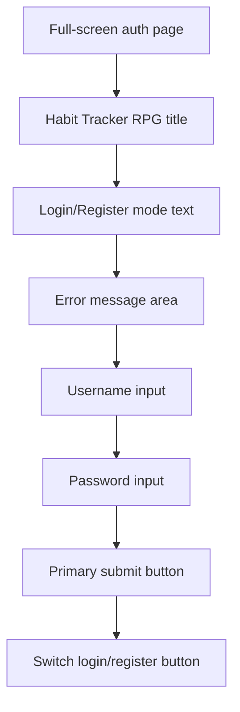
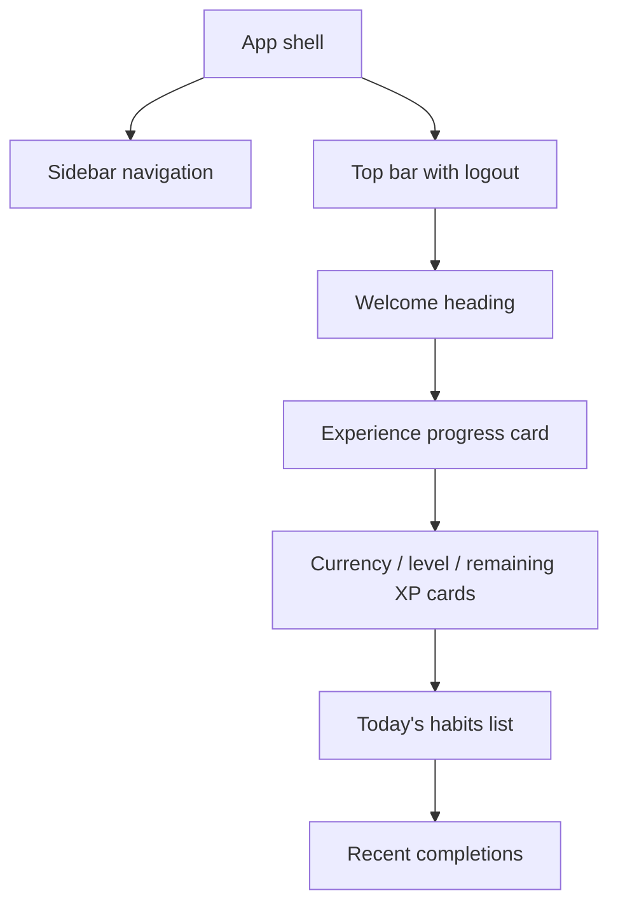
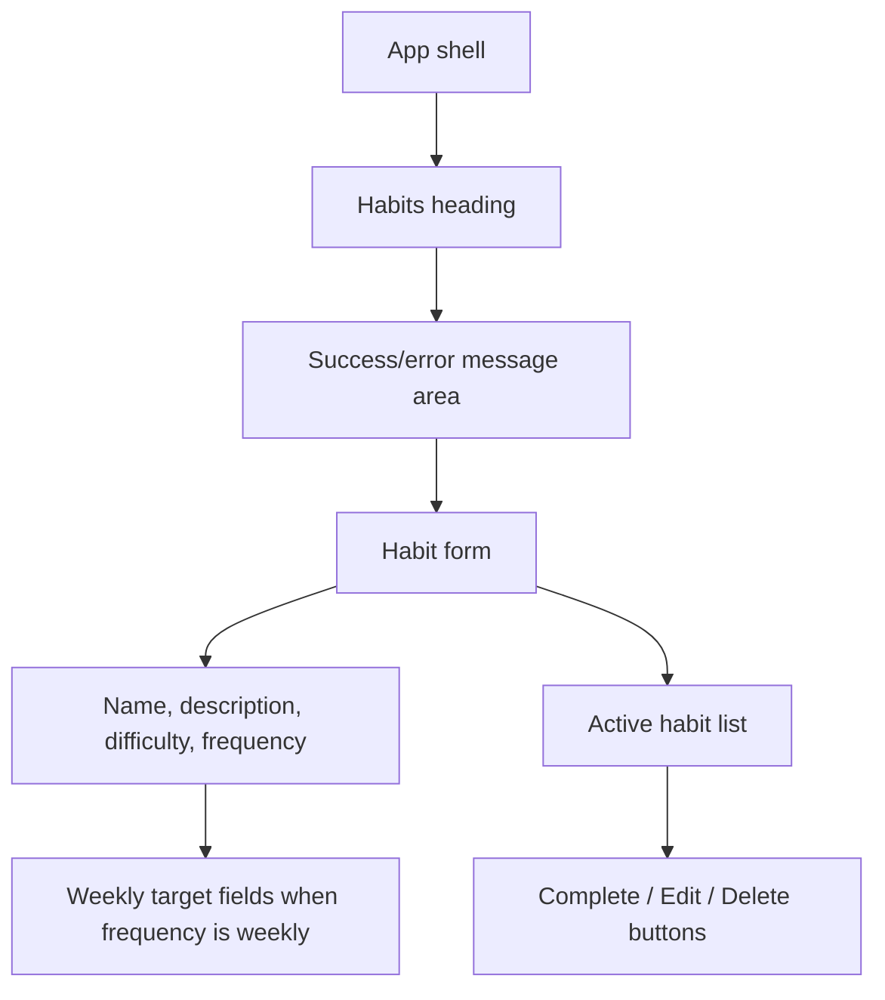
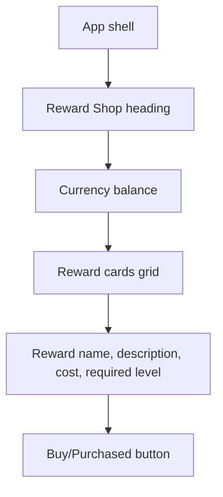
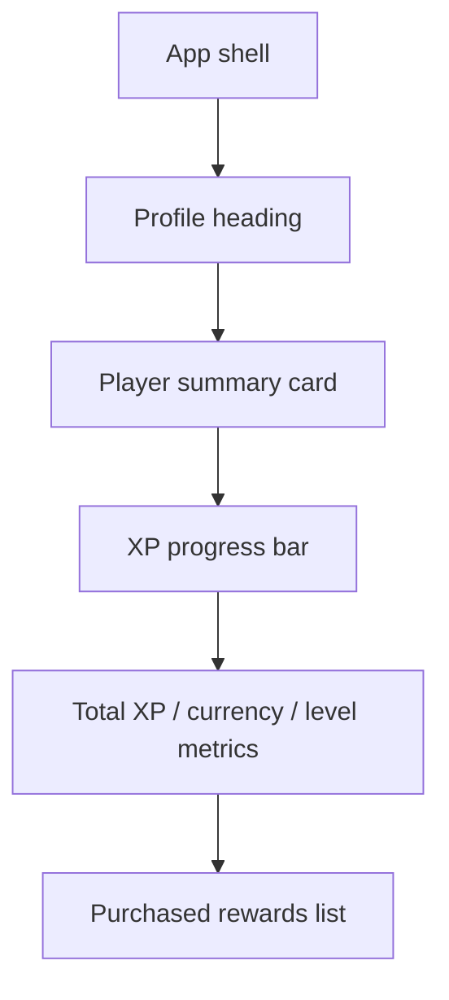

# GUI Wireframes

## Purpose

These Mermaid wireframes document the main screens of the Habit Tracker RPG interface. They describe layout structure rather than final visual styling.

## Authentication Screen

## Dashboard Screen

## Habit Management Screen

## Reward Shop Screen

## Profile Screen

