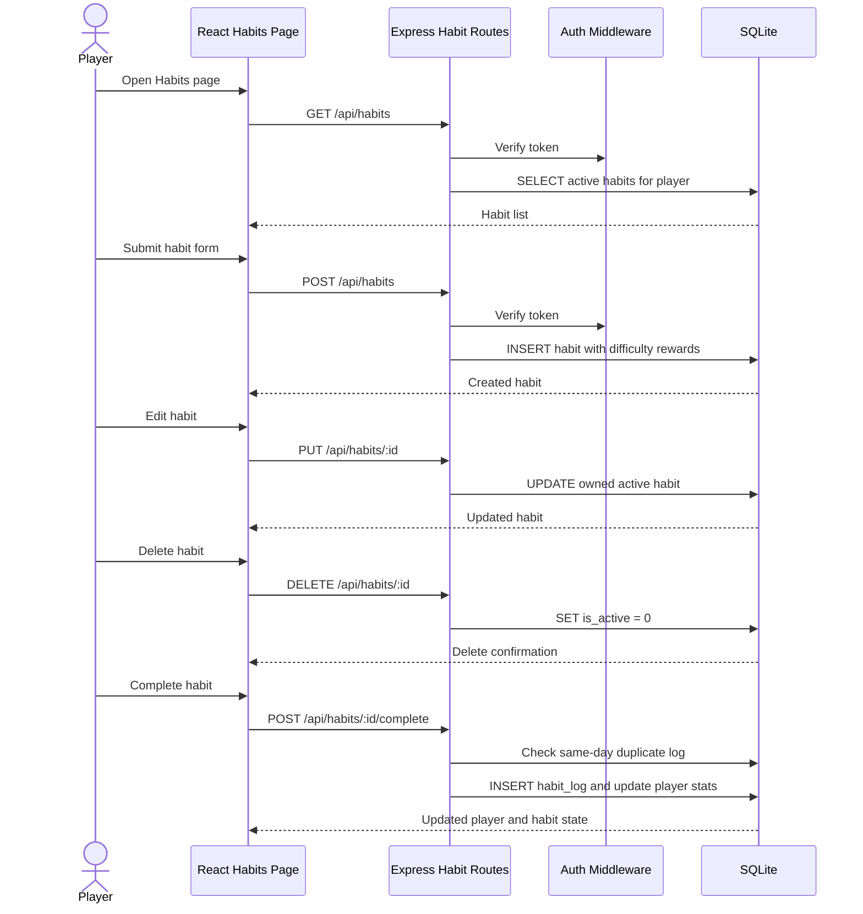

# Habit CRUD Sequence

## Purpose

This sequence diagram shows the standard lifecycle for listing, creating, editing, deleting, and completing habits.

```mermaid
sequenceDiagram
    actor Player
    participant UI as React Habits Page
    participant API as Express Habit Routes
    participant Auth as Auth Middleware
    participant DB as SQLite

    Player->>UI: Open Habits page
    UI->>API: GET /api/habits
    API->>Auth: Verify token
    API->>DB: SELECT active habits for player
    DB-->>UI: Habit list

    Player->>UI: Submit habit form
    UI->>API: POST /api/habits
    API->>Auth: Verify token
    API->>DB: INSERT habit with difficulty rewards
    DB-->>UI: Created habit

    Player->>UI: Edit habit
    UI->>API: PUT /api/habits/:id
    API->>DB: UPDATE owned active habit
    DB-->>UI: Updated habit

    Player->>UI: Delete habit
    UI->>API: DELETE /api/habits/:id
    API->>DB: SET is_active = 0
    DB-->>UI: Delete confirmation

    Player->>UI: Complete habit
    UI->>API: POST /api/habits/:id/complete
    API->>DB: Check same-day duplicate log
    API->>DB: INSERT habit_log and update player stats
    DB-->>UI: Updated player and habit state
```
