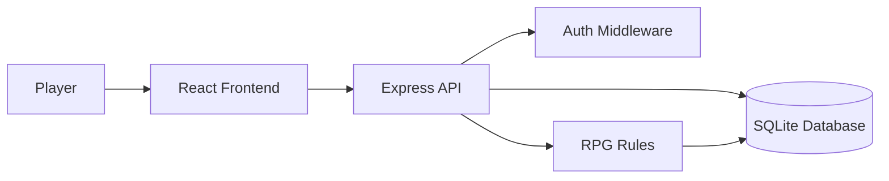

# High-Level Design

## Purpose

This diagram documents the core client-server architecture of the Habit Tracker RPG system.

## Architecture Overview

The Habit Tracker RPG system is a client-server web application. The React frontend provides authenticated screens for player progress, habit management, reward purchases, and profile history. The Express backend exposes JSON APIs, validates requests, applies RPG rules, and persists state in SQLite.

## Components

* **Frontend:** React routes, Tailwind UI, API service, protected app views.
* **Backend:** Express app, auth routes, habit routes, reward routes, player profile routes.
* **Database:** players, habits, habit logs, rewards, purchased rewards.
* **RPG Logic:** difficulty reward mapping, total-XP level thresholds, currency balance updates.

## Data Flow

* Authentication flow: frontend submits credentials, backend validates them, backend returns a signed token, frontend stores it and sends it as a bearer token.
* Habit completion flow: frontend requests completion, backend checks habit ownership and duplicate completion, inserts a log, updates XP/currency, recalculates level, and returns updated player state.
* Reward purchase flow: frontend requests a purchase, backend checks level, currency, and duplicate purchases, inserts purchase history, deducts currency, and returns updated player state.
