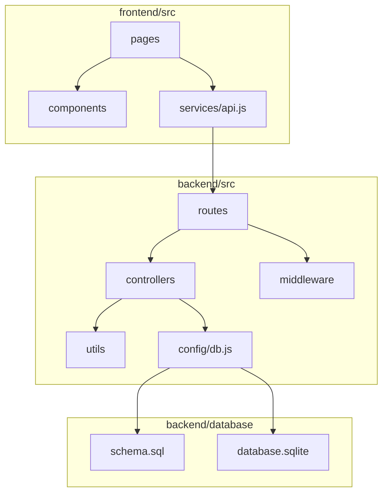

# Package Diagram - Application Structure

## Purpose

This diagram shows the main source-code packages and how frontend, backend, and database files relate to each other.

```mermaid
flowchart TB
    subgraph frontend[frontend/src]
        pages["pages"]
        components["components"]
        services["services/api.js"]
    end

    subgraph backend[backend/src]
        routes["routes"]
        controllers["controllers"]
        middleware["middleware"]
        utils["utils"]
        config["config/db.js"]
    end

    subgraph database[backend/database]
        schema["schema.sql"]
        sqlite["database.sqlite"]
    end

    pages --> components
    pages --> services
    services --> routes
    routes --> middleware
    routes --> controllers
    controllers --> utils
    controllers --> config
    config --> schema
    config --> sqlite
```
