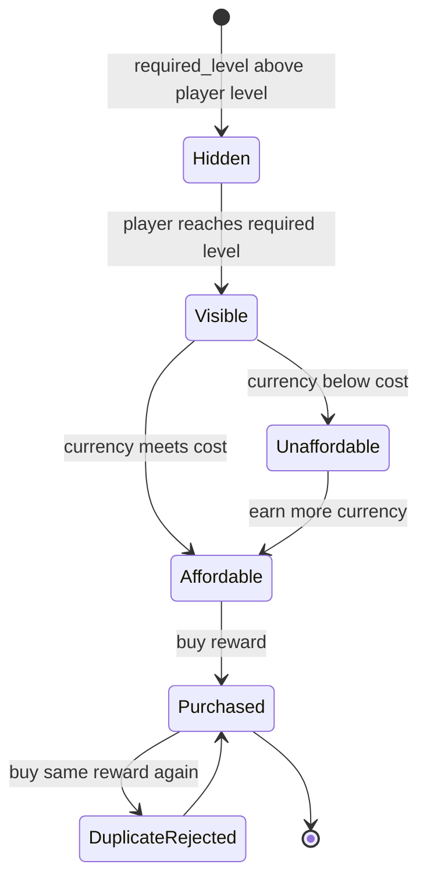

# Reward Lifecycle State

## Purpose

This state machine shows how rewards become visible, affordable, purchased, or rejected by validation rules.

```mermaid
stateDiagram-v2
    [*] --> Hidden: required_level above player level
    Hidden --> Visible: player reaches required level
    Visible --> Unaffordable: currency below cost
    Visible --> Affordable: currency meets cost
    Unaffordable --> Affordable: earn more currency
    Affordable --> Purchased: buy reward
    Purchased --> DuplicateRejected: buy same reward again
    DuplicateRejected --> Purchased
    Purchased --> [*]
```
