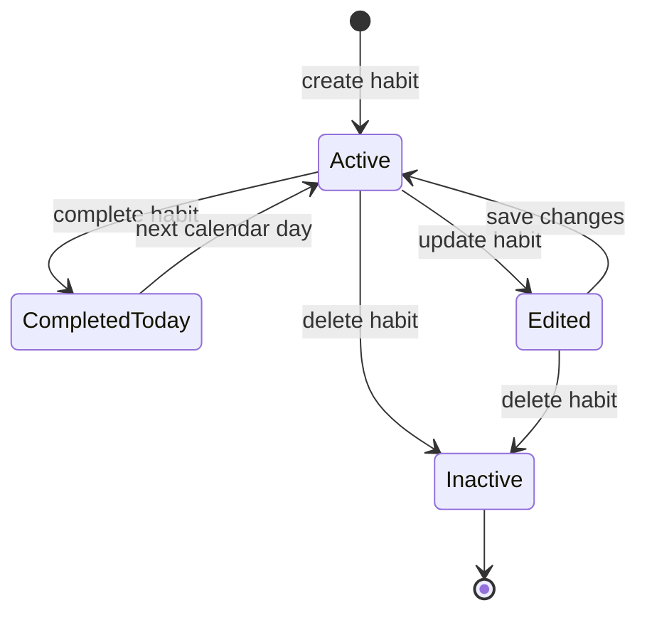

# State Machine Diagram - Habit Lifecycle

## Purpose

This state machine documents how a habit moves between active, completed-today, edited, and inactive states.

```mermaid
stateDiagram-v2
    [*] --> Active: create habit
    Active --> CompletedToday: complete habit
    CompletedToday --> Active: next calendar day
    Active --> Edited: update habit
    Edited --> Active: save changes
    Active --> Inactive: delete habit
    Edited --> Inactive: delete habit
    Inactive --> [*]
```
