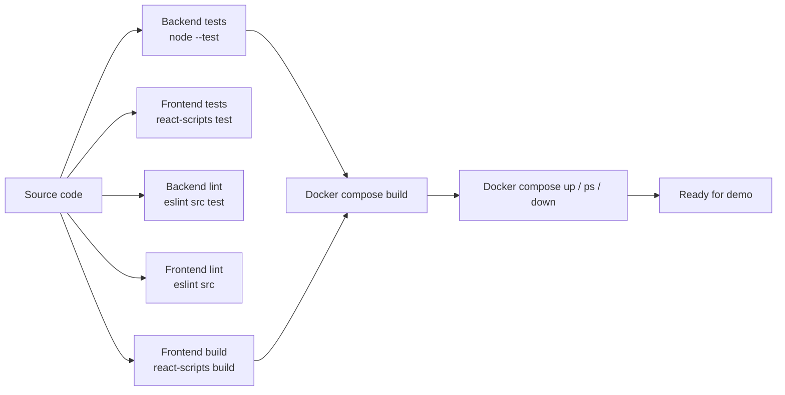

# Testing Strategy Diagram

## Purpose

This diagram shows the verification layers used to confirm the project works before presentation.

```mermaid
flowchart LR
    source["Source code"]
    backendTests["Backend tests\nnode --test"]
    frontendTests["Frontend tests\nreact-scripts test"]
    backendLint["Backend lint\neslint src test"]
    frontendLint["Frontend lint\neslint src"]
    frontendBuild["Frontend build\nreact-scripts build"]
    dockerBuild["Docker compose build"]
    dockerSmoke["Docker compose up / ps / down"]
    ready["Ready for demo"]

    source --> backendTests
    source --> frontendTests
    source --> backendLint
    source --> frontendLint
    source --> frontendBuild
    backendTests --> dockerBuild
    frontendBuild --> dockerBuild
    dockerBuild --> dockerSmoke
    dockerSmoke --> ready
```
