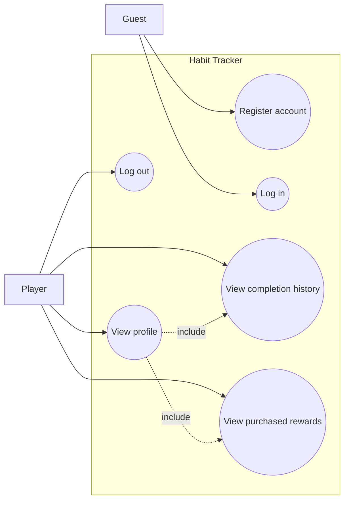

# Use Case Diagram - Authentication and Profile

## Purpose

This diagram focuses on authentication, profile viewing, completion history, and purchased reward history.

```mermaid
flowchart LR
    guest["Guest"]
    player["Player"]

    subgraph system[Habit Tracker]
        register(("Register account"))
        login(("Log in"))
        logout(("Log out"))
        viewProfile(("View profile"))
        viewHistory(("View completion history"))
        viewPurchased(("View purchased rewards"))
    end

    guest --> register
    guest --> login

    player --> logout
    player --> viewProfile
    player --> viewHistory
    player --> viewPurchased

    viewProfile -. "include" .-> viewHistory
    viewProfile -. "include" .-> viewPurchased
```
