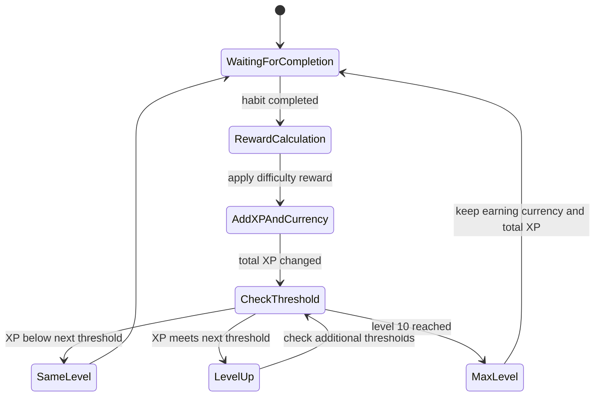

# XP Leveling State

## Purpose

This state machine documents how a player gains total XP, receives currency, and advances through level thresholds.

```mermaid
stateDiagram-v2
    [*] --> WaitingForCompletion
    WaitingForCompletion --> RewardCalculation: habit completed
    RewardCalculation --> AddXPAndCurrency: apply difficulty reward
    AddXPAndCurrency --> CheckThreshold: total XP changed
    CheckThreshold --> SameLevel: XP below next threshold
    CheckThreshold --> LevelUp: XP meets next threshold
    LevelUp --> CheckThreshold: check additional thresholds
    SameLevel --> WaitingForCompletion
    CheckThreshold --> MaxLevel: level 10 reached
    MaxLevel --> WaitingForCompletion: keep earning currency and total XP
```
