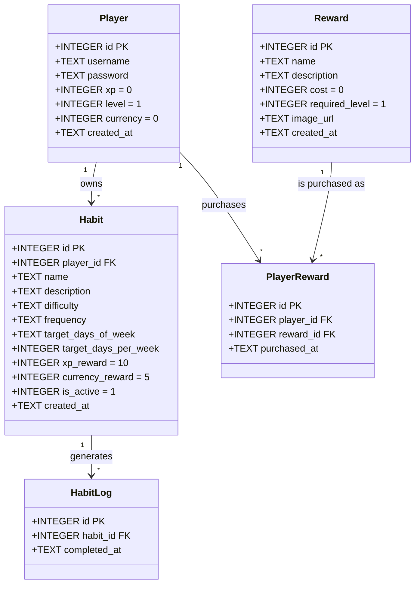

# Class Diagram - Habit Tracker

This diagram presents the Habit Tracker data structure. It shows players, habits, completion logs, rewards, and purchased rewards with their main fields and relationships.

