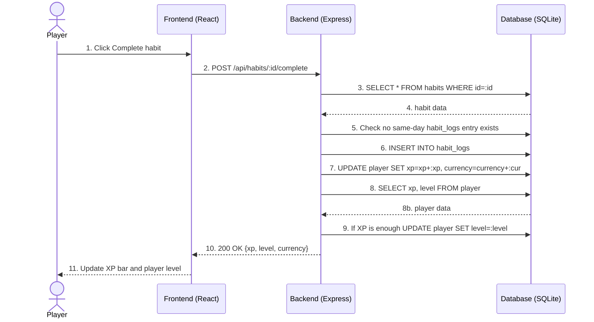

# Sequence Diagram - Completing a Habit

## Purpose

This diagram shows communication between the player, frontend, backend, and database when a habit is marked as completed. The sequence includes saving a log entry, adding rewards, loading player data, and optionally updating the level.

