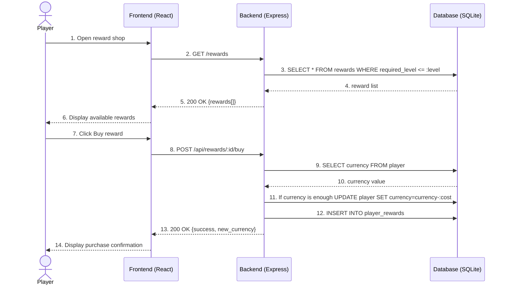

# Sequence Diagram - Buying a Reward

## Purpose

This diagram describes message flow while browsing the reward shop and buying a reward. The backend loads rewards available for the player's level, checks currency, subtracts the cost, and saves the purchase in the database.

