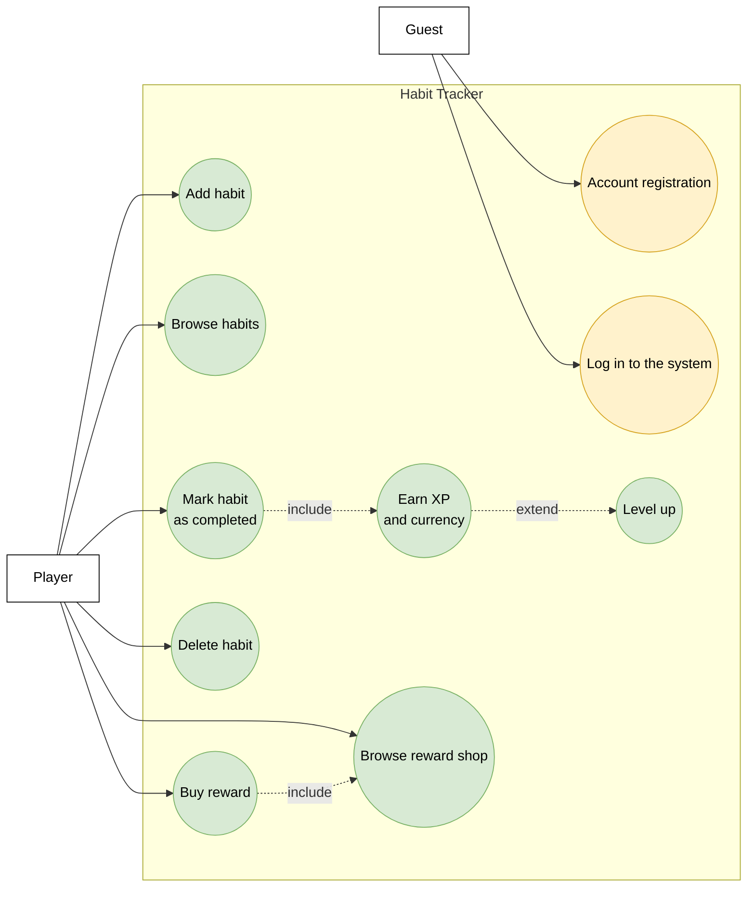

# Use Case Diagram - Habit Tracker

This diagram presents the main Habit Tracker use cases. A guest can register an account and log in, while a player can manage habits, earn XP and currency, level up, and buy rewards.

